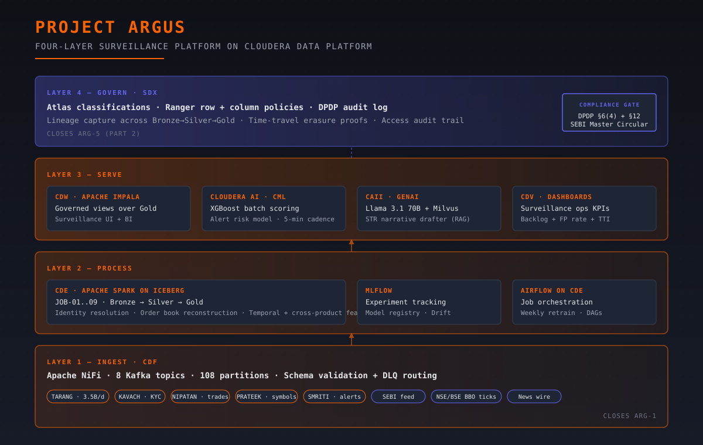

# Project ARGUS — Real-Time Spoofing & Layering Detection on Cloudera Data Platform

[](https://docs.cloudera.com/cdf/)
[](https://docs.cloudera.com/cde/)
[](https://docs.cloudera.com/csa/)
[](https://iceberg.apache.org/)
[](https://docs.cloudera.com/cdw/)
[](https://docs.cloudera.com/machine-learning/)
[](https://docs.cloudera.com/machine-learning/cloud/ai-inference/)
[](https://docs.cloudera.com/data-fabric/)

A 10-day, 7-module capstone that rebuilds Magic Street Exchange's market-surveillance platform on Cloudera Data Platform. Magic Street Exchange (MSE) — a fictional #3 Indian stock exchange — sits under a SEBI Show Cause Notice after its legacy surveillance system failed to detect 14 manipulative episodes during F&O expiry-day volume spikes, costing retail investors and the exchange alike. You will build the platform that closes those gaps: streaming ingest at 150K events/sec on three specialized engines (Spark, PyFlink CEP, SQL Stream Builder) — sub-second pattern detection runs alongside canonical persistence on a shared Kafka backbone — order-book reconstruction with Iceberg time-travel, cross-product temporal feature engineering, an XGBoost alert risk-ranker that cuts the 92% false-positive rate, a GenAI Suspicious Transaction Report drafter that turns 60-minute reports into 8-minute ones, and a DPDP Act 2023 compliance workflow that survives a regulator audit.

## Architecture



Four layers, top-down: **Govern** (SDX — Atlas classifications + Ranger row/column policies + DPDP audit trail), **Serve** (CDW Impala governed views, CML batch scoring, CAII GenAI endpoint, CDV dashboards), **Process** (CDE Spark on Iceberg with time-travel, **CSA / PyFlink CEP for sub-second pattern detection, SQL Stream Builder for analyst-deployed streaming SQL**, MLflow tracking, Airflow orchestration), **Ingest** (CDF/NiFi feeding 9 production + 2 DLQ Kafka topics with schema validation, consumed by all three streaming engines). See [`docs/01_architecture.md`](docs/01_architecture.md) for the full architecture writeup and the service-to-layer mapping.

## Diagrams

📊 **Nine flow diagrams** illustrate every module and the master plan: [`assets/diagrams/`](assets/diagrams/README.md). Each is provided in two formats — SVG (sharp embed for HTML) and Mermaid (renders inline in GitHub Markdown). Diagrams cover Day 1 setup, all 7 modules, and a master 10-day timeline showing checkpoint gates and deficiency closures.

## Quick start

```bash
# 1. Clone and install
git clone https://github.com/cloudera-training/argus-capstone.git
cd argus-capstone
pip install -r requirements.txt

# 2. Generate synthetic data (50M order events, 4.8M historical alerts, all reference data)
#    Reproducible — same --seed produces the same planted test cases at indices 0-22
python data/generate_data.py --seed 42 --out data/generated/

# 3. Provision your CDP environment (S3 bucket, Kafka topics, Iceberg DDL)
export STUDENT_ID=<your-student-id>
bash sql/provision_environment.sh
hive -f sql/bronze_ddl.sql
hive -f sql/silver_ddl.sql
hive -f sql/gold_ddl.sql

# 4. Bulk-load Bronze with FLOW-SIM oneshot mode
python src/ingest/replay_simulator.py --mode oneshot \
    --data-dir data/generated/ \
    --bootstrap-servers ${KAFKA_BROKERS}

# 5. Continue with Module 1 — see docs/module-1-streaming-ingest.md
```

## Module index

| # | Module | Closes deficiency | Doc |
|---:|---|---|---|
| — | Scenario narrative | — | [`docs/00_scenario.md`](docs/00_scenario.md) |
| — | Architecture (4-layer) | — | [`docs/01_architecture.md`](docs/01_architecture.md) |
| — | Data sources (5 internal + 3 external) | — | [`docs/02_data_sources.md`](docs/02_data_sources.md) |
| Day 1 | Setup | — | [`docs/03_day1_setup.md`](docs/03_day1_setup.md) |
| 1 | CDF + PyFlink CEP + SSB streaming ingest & real-time detection | ARG-1 (peak volume + latency) | [`docs/module-1-streaming-ingest.md`](docs/module-1-streaming-ingest.md) |
| 2 | Identity resolution & order book reconstruction | ARG-2 (part 1) | [`docs/module-2-cde-identity.md`](docs/module-2-cde-identity.md) |
| 3 | Temporal & cross-product feature engineering | ARG-2 (part 2) | [`docs/module-3-cde-features.md`](docs/module-3-cde-features.md) |
| 4 | CDW governed views with Ranger | ARG-5 (part 1) | [`docs/module-4-cdw-governed-views.md`](docs/module-4-cdw-governed-views.md) |
| 5 | XGBoost alert risk-ranking | ARG-3 (false positives) | [`docs/module-5-cml-ml.md`](docs/module-5-cml-ml.md) |
| 6 | GenAI STR narrative engine (RAG) | ARG-4 (hand-written reports) | [`docs/module-6-cml-genai.md`](docs/module-6-cml-genai.md) |
| 7 | SDX governance & DPDP compliance | ARG-5 (part 2) | [`docs/module-7-sdx-governance.md`](docs/module-7-sdx-governance.md) |

Lab files (one per `lab-N-M`) are under [`labs/`](labs/) and referenced from the module docs.

## Prerequisites

| Component | Required version |
|---|---|
| Cloudera Data Platform | Public Cloud 7.3.x or Private Cloud Base 7.3.x with Data Services |
| AWS region (for S3) | `ap-south-1` (Mumbai) — chosen for DPDP data-residency |
| IAM roles | CDP cross-account role with S3 bucket read/write + Kafka cluster admin + Atlas/Ranger admin |
| Python | 3.10 or newer |
| Apache Spark | 3.5.x (provided by CDE runtime) |
| Apache Iceberg | 1.5.x or newer (provided by CDE runtime) |
| Kafka | 3.6+ (CDF-managed) |
| Cloudera AI workbench | 2.0.46+ with GPU pool for Module 6 |

A CDP cluster sized for this capstone needs roughly: 6 worker nodes (16 vCPU, 64 GB RAM each) for Spark + Iceberg + Kafka, plus a GPU node (1× A10 or better) for Module 6 LLM inference. Smaller clusters work but Module 1 streaming throughput targets become harder to hit.

## Schedule

Ten working days, mapped module-to-day with checkpoint gates. See [`docs/schedule.md`](docs/schedule.md) for the full day-by-day breakdown. The capstone exam runs on Day 10 and includes a live integration test that takes a fresh planted manipulation case from ingest through STR draft.

## Assessment

Total: 100% + 5% bonus. Components:

- Module 1 (streaming ingest + real-time detection) — 15%
- Modules 2–3 (feature engineering) — 25%
- Module 4 (governed views) — 10%
- Module 5 (ML model) — 20%
- Module 6 (GenAI drafter) — 15%
- Module 7 (compliance & governance) — 15%
- Bonus (cross-product Jane Street replication) — +5%

**Pass threshold**: 70% overall AND CP-19 must pass. CP-19 is a non-negotiable **COMPLIANCE GATE** — failing it means failing the capstone regardless of overall score. See [`docs/assessment.md`](docs/assessment.md) for the full rubric and the 21 checkpoints.

## License & maintainer

Apache 2.0 — see [`LICENSE`](LICENSE).

Maintained by **Cloudera Training & Enablement**. For curriculum questions, file an issue tagged `curriculum`. For technical/lab issues, tag `lab-bug`.

This is a teaching capstone built around a fictional company (Magic Street Exchange) and fictional internal systems (TARANG, KAVACH, NIPATAN, PRATEEK, SMRITI). Any resemblance to real exchanges, brokers, or trading firms is for pedagogical purposes only. Regulatory references — SEBI Master Circular on Surveillance of Securities Market (09-Jul-2024), SEBI PFUTP Regulations 2003, DPDP Act 2023 + Rules 2025 — are real and current as of the cohort tag.
