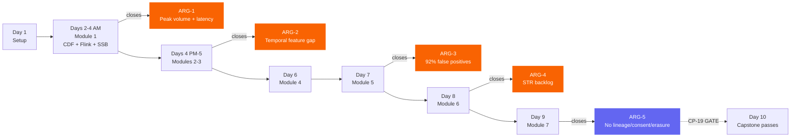

# Master Overview — 10-Day Project Plan

The full ARGUS capstone arc, day-by-day, with checkpoint gates and deficiency closures. This is the same view as `assets/diagrams/00_master_overview.svg` but rendered inline by GitHub.

## Gantt — module phases + checkpoints

```mermaid
gantt
    title Project ARGUS — 10-day timeline (per-student work, shared cluster)
    dateFormat  X
    axisFormat  Day %s

    section Setup
    Day 1 Provisioning                            :setup, 0, 1d

    section Module 1 — CDF + Flink + SSB (3.5d)
    NiFi flows + Spark Streaming Bronze           :m1a, 1, 1d
    PyFlink CEP + SSB SQL                         :m1b, 2, 1d
    150K ev/s combined-engine throughput test     :crit, m1t, 3, 1d

    section Module 2 — Identity + Book (1.5d)
    SCD2 + fuzzy match + book reconstruction      :m2, 3, 2d

    section Module 3 — Features + Rules
    Temporal + cross-product features             :m3, 5, 1d
    5 deterministic rules fire (batch)            :crit, m3r, after m3, 0d

    section Module 4 — CDW Governed Views
    Impala views + Ranger × 3 roles               :m4, 6, 1d

    section Module 5 — CML / MLflow
    XGBoost + Hyperopt + Production gate          :m5, 7, 1d
    AUC ≥ 0.82 verified                           :crit, m5p, after m5, 0d

    section Module 6 — GenAI / RAG
    Llama 3.1 70B + Milvus + STR drafts           :m6, 7, 1d

    section Module 7 — SDX Governance
    Atlas tags + DPDP §6(4) consent               :m7, 8, 1d
    CP-19 COMPLIANCE GATE (DPDP §12 erasure)      :crit, gate, after m7, 0d

    section Day 10 Capstone
    End-to-end integration + assessment           :cap, 9, 1d
```

## Deficiency closure track

## Cumulative checkpoint progress

| End of day | Cumulative CPs | New deficiency closure |
|---|---|---|
| Day 1 | CP-00, 01 | — (provisioning) |
| Day 2 | + CP-02, 04 | (M1 partial — Bronze ingest live) |
| Day 3 | + CP-02b, 04b | (M1 partial — real-time detection live) |
| Day 4 AM | + CP-03 | **ARG-1** ✅ (combined-engine throughput verified) |
| Day 5 | + CP-05, 06 | (ARG-2 partial) |
| Day 6 | + CP-07, 08, 09 | **ARG-2** ✅ |
| Day 7 | + CP-10, 11, 12 | (ARG-5 partial) |
| Day 8 | + CP-13, 14, 15, 16 | **ARG-3** ✅ + **ARG-4** ✅ |
| Day 9 | + CP-17, 18, **19** | **ARG-5** ✅ — *all 5 deficiencies closed* |
| Day 10 | + CP-20 | (integration test) |

> ⚠ **CP-19 is the COMPLIANCE GATE** — DPDP §12 erasure with Iceberg time-travel proof. Failing CP-19 fails the capstone regardless of overall score.
