# Day 1 — Environment Setup

Activity flow showing what the student does today, what the system does in response, and how each step is verified at a checkpoint.

```mermaid
flowchart LR
    classDef instructor fill:#1e2535,stroke:#9ca3af,color:#9ca3af
    classDef student   fill:#161b27,stroke:#f96302,stroke-width:2px,color:#e5e7eb
    classDef system    fill:#1e2535,stroke:#9ca3af,color:#e5e7eb
    classDef checkpoint fill:#161b27,stroke:#f96302,stroke-width:2px,color:#f96302
    classDef gate      fill:#1a1632,stroke:#6366f1,stroke-width:2px,color:#6366f1

    PRE["<b>INSTRUCTOR (pre-Day 1)</b><br/>Per-student S3 bucket created<br/>7 prefixes + AES256 + versioning"]:::instructor

    S1["<b>Step 1 — env vars (5 min)</b><br/>export STUDENT_ID=s001<br/>export BUCKET_NAME=&lt;from instructor&gt;"]:::student
    S2["<b>Step 2 — provision (2 min)</b><br/>bash sql/provision_environment.sh"]:::student
    S3["<b>Step 3 — Iceberg DDL (5 min)</b><br/>envsubst &lt; sql/*_ddl.sql | hive -f -"]:::student
    S4["<b>Step 4 — synthetic data (10 min)</b><br/>python data/generate_data.py --seed 42"]:::student
    S5["<b>Step 5 — bulk-load (10 min)</b><br/>python src/ingest/replay_simulator.py<br/>--mode oneshot"]:::student

    K["Kafka cluster<br/>10 topics created with<br/>argus.${STUDENT_ID}.* prefix"]:::system
    H["Hive Metastore<br/>19 Iceberg tables registered<br/>consent_audit: history never expires"]:::system
    D["data/generated/<br/>14 files · 2.5M order events<br/>23 planted cases at idx 0-22"]:::system
    KP["Kafka topics populated<br/>orders.v1 ≈ 2.5M msgs<br/>trades.v1 ≈ 175K msgs<br/>bbo.v1 ≈ 350K msgs"]:::system

    CP00a["✓ CP-00 (bucket + topics)<br/>7 prefixes visible<br/>10 topics with right partitions"]:::checkpoint
    CP00b["⚠ CP-00 (tables) CRITICAL<br/>All 19 tables created<br/>history.expire.enabled=false"]:::gate
    CP01["✓ CP-01 (bulk-load)<br/>Topic counts within ±10%<br/>Partitions evenly distributed"]:::checkpoint

    DONE(["✅ DAY 1 COMPLETE<br/>Module 1 starts Day 2"])

    PRE -.-> S1
    S1 --> S2 --> K
    K --> CP00a
    S2 --> S3 --> H
    H --> CP00b
    S3 --> S4 --> D
    D --> S5 --> KP
    KP --> CP01
    CP00a --> S3
    CP00b --> S4
    CP01 --> DONE
```

## Key points

- **Bucket is instructor-provisioned** — you only verify it. Topics are **per-student** namespaced (`argus.${STUDENT_ID}.*`) so 16 students share one cluster without colliding.
- **SQL DDL files are templates** — pipe through `envsubst` to substitute `STUDENT_ID` at runtime.
- **CP-00 Check 4 is critical**: `consent_audit` must have `history.expire.enabled=false` — CP-19's compliance gate depends on it.
- **No NiFi, no Spark jobs, no ML, no governance enforcement today.** Today is plumbing. Day 2 starts the 3-engine streaming ingest & real-time detection (Module 1: NiFi + Spark + Flink + SSB).
