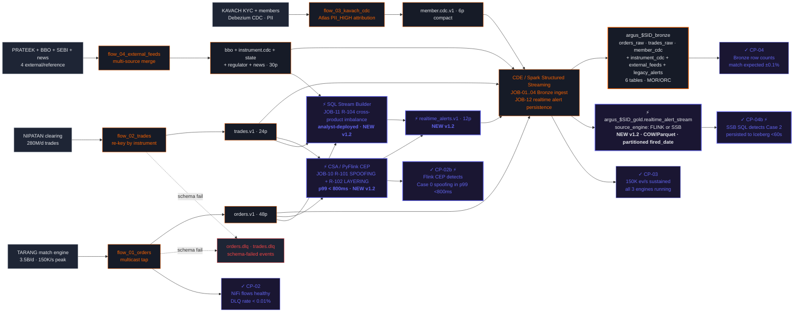

# Module 1 — CDF + Flink + SSB Streaming Ingest & Real-Time Detection

Days 2-4 (3.5 days) · Closes **ARG-1** · CP-02 / CP-02b / CP-03 / CP-04 / CP-04b



## Three engines, one Kafka backbone

The architectural insight of Module 1: all three engines read the same source events. They don't compete — they specialize.

| Engine | Job(s) | Owns | Latency | Authored by |
|---|---|---|---|---|
| **Spark Structured Streaming** | JOB-01..04, JOB-12 | Canonical persistence + realtime sink | ~10s trigger | Engineering |
| **PyFlink CEP** *(new in v1.2)* | JOB-10 | Sub-second pattern detection | **<800ms p99** | Engineering |
| **SSB SQL** *(new in v1.2)* | JOB-11 | Analyst-driven streaming SQL | ~30s | Surveillance analyst |

JOB-10 and JOB-11 do **not** replace JOB-08 batch (Module 3). They run in parallel — the same `event_id` from a planted spoofing case lands in both `gold.alert_candidates` (within 30 min, batch) and `gold.realtime_alert_stream` (within 800ms, streaming). When they disagree, that's a debugging signal. The lab in 1.5 covers this comparison explicitly.

## What this closes

ARG-1 has two halves: peak ingest throughput, and peak detection latency. The legacy CEP engine failed both. Spark + Kafka fixes the throughput half; PyFlink CEP + SSB SQL fix the latency half. By the end of Module 1 a planted Case 0 spoofing event triggers an alert in under one second — the analyst can intervene before the trader cycles to the next attempt.

## The latency comparison test

```sql
-- CP-02b + CP-04b verification: the 3-engine cross-check
SELECT
    pattern_type,
    source_engine,
    COUNT(*)                                 AS n_alerts,
    ROUND(PERCENTILE(detection_latency_ms, 0.5),  0) AS p50_ms,
    ROUND(PERCENTILE(detection_latency_ms, 0.99), 0) AS p99_ms
FROM argus_${STUDENT_ID}_gold.realtime_alert_stream
WHERE fired_date = CURRENT_DATE
GROUP BY pattern_type, source_engine
ORDER BY pattern_type, source_engine;
-- Expect: SPOOFING|FLINK p99 < 800ms · CROSS_PRODUCT_IMBALANCE|SSB p99 < 60000ms
```

When you re-run this query in Module 3 after JOB-08 batch has fired, the same `event_id` will appear in both this table and `gold.alert_candidates` — proving the streaming and batch paths are detecting the same patterns, just at different latencies.
