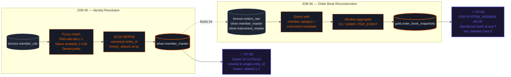

# Module 2 — Identity Resolution + Order Book Reconstruction

Days 3-4 · Closes **ARG-2 (Part 1)** · CP-05 (Iceberg time-travel) · CP-06 (fuzzy match)

## Two parallel pipelines



## What this closes

The legacy platform couldn't:
- **Reconstruct the book at past timestamps** — investigators waited 11 weeks for offline reconstructions that were too late to enforce
- **Merge investors across brokers** — coordinated multi-broker manipulation looked like 3+ independent participants

Module 2 fixes both. Iceberg time-travel makes book reconstruction a single SQL query (`FOR SYSTEM_VERSION AS OF <snapshot>`); multi-signal fuzzy match merges Cases 10-14 in JOB-05.

## The time-travel test

```sql
-- CP-05: reproduce the book state when planted Case 0 was happening
SELECT *
FROM argus_${STUDENT_ID}_gold.order_book_snapshots
  FOR SYSTEM_VERSION AS OF <pre-event-snapshot-id>
WHERE instrument_code = 'BNXM-0042-FUT' AND
      snapshot_ts BETWEEN '2026-03-15 11:23:42.000' AND '2026-03-15 11:23:42.500';
-- Should show 5+ stacked layered orders cancelled within 200ms of an opposite-side fill
```
