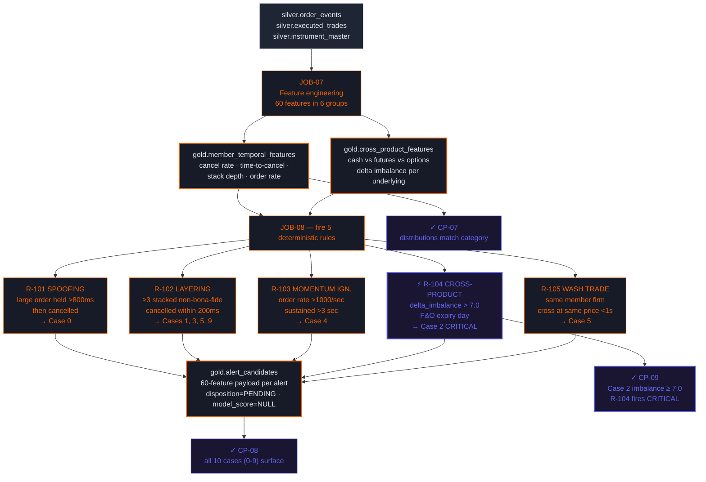

# Module 3 — Temporal + Cross-Product Features + Rules

Day 5 · Closes **ARG-2 (Part 2)** · CP-07 / CP-08 / CP-09 (R-104 Jane Street)



## What this closes

The legacy CEP engine couldn't compute features that span more than one product (cash + F&O + options) on the same underlying — the literal pattern that defeated detection in the **Jane Street 2024 SEBI case**. Spark + Iceberg lets JOB-07 join across all three product types in a single batch and compute the imbalance metric that R-104 fires on.

After Module 3 every planted manipulation case (0-9) is detected. Modules 5+ then prioritize to remove the noise.

## The cross-product test

```sql
-- CP-09: verify Case 2 (Jane Street pattern) fires R-104
SELECT
    member_firm_id,
    underlying_code,
    cross_product_delta_imbalance,
    is_expiry_day
FROM argus_${STUDENT_ID}_gold.cross_product_features
WHERE planted_case_idx = 2
  AND cross_product_delta_imbalance >= 7.0
  AND is_expiry_day = TRUE;
-- Should show member_firm_id = 'BNXM-0231' with imbalance ≥ 7.0
```

## Bonus criterion (5%)

The bonus is awarded for replicating the Jane Street detection without leaning on R-104 — a SQL query against `cross_product_features` that flags Case 2 in its top 3 results using only behavioral features, no hardcoded identifier. Tests whether the student understands the *structural* pattern, not just the rule.
