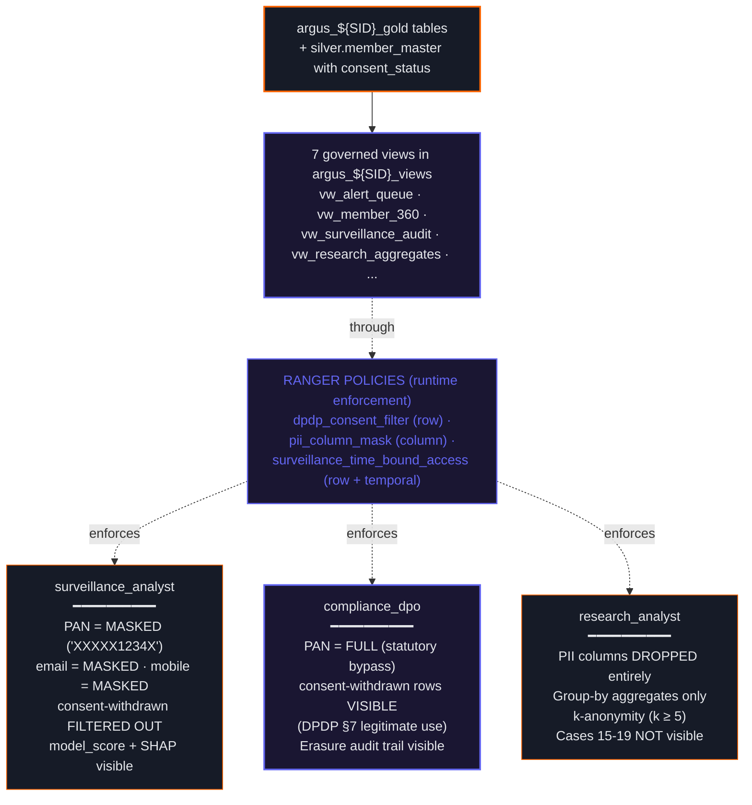

# Module 4 — Governed Views + Ranger Policies

Day 6 · Closes **ARG-5 (Part 1)** · CP-10 (views) · CP-11 (policy enforcement)

## Same data, three roles, three different shapes



## What each role sees for the same alert

Sample alert: a planted Case 15 LAYERING by `BNXM-0117` involving investor PAN `ABCDE1234F`, who withdrew consent for ANALYTICS on Day 8.

| Field | surveillance_analyst | compliance_dpo | research_analyst |
|---|---|---|---|
| `alert_id` | `ALERT-X1234` | `ALERT-X1234` | aggregated |
| `member_firm_id` | `BNXM-0117` | `BNXM-0117` | aggregated |
| `investor_pan` | `XXXXX1234F` | `ABCDE1234F` | (column dropped) |
| `investor_email` | `xx@xx.com` | full | (column dropped) |
| `consent_status` | filtered out | `WITHDRAWN_FOR_ANALYTICS` | (row excluded) |
| `model_score` | `0.847` (visible) | `0.847` | aggregated only |
| `shap_top_10` | visible | visible | not visible |

## CP-11 verification — three role-switches in sequence

```sql
-- As surveillance_analyst
SET ROLE surveillance_analyst;
SELECT alert_id, investor_pan FROM argus_${STUDENT_ID}_views.vw_alert_queue
WHERE planted_case_idx = 15;
-- investor_pan should show as 'XXXXX1234F'

-- As compliance_dpo (statutory bypass)
SET ROLE compliance_dpo;
SELECT alert_id, investor_pan FROM argus_${STUDENT_ID}_views.vw_surveillance_audit
WHERE planted_case_idx = 15;
-- investor_pan should show full 'ABCDE1234F'

-- As research_analyst (cases 15-19 filtered)
SET ROLE research_analyst;
SELECT COUNT(*) FROM argus_${STUDENT_ID}_views.vw_research_aggregates
WHERE planted_case_idx BETWEEN 15 AND 19;
-- Should return 0
```
