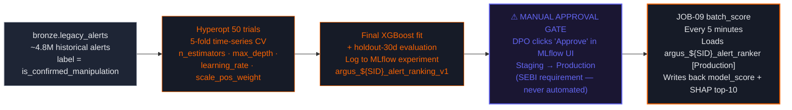
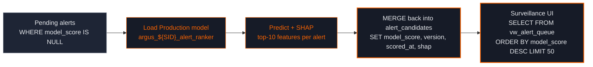

# Module 5 — ML Alert Risk-Ranking

Day 7 · Closes **ARG-3** (92% false-positive flood) · CP-12 / CP-13 / CP-14

## Training pipeline with manual production gate

## CP-13 pass criteria — the bar for production

| Metric | Threshold | What it tests |
|---|---|---|
| AUC-ROC | ≥ 0.82 | Overall ranking quality |
| Top-decile precision | ≥ 0.55 | Top 10% of alerts have ≥ 55% true positives |
| Planted-case separation | Cases 0/1/2 score ≥ 2× Cases 6/7 | Real cases rank above false positives |
| Calibration | Predicted vs actual within 5% per bin | Probabilities match reality |

If ANY of these fail → DPO does NOT click Approve, model stays in Staging, training iterates next week. **No automated promotion ever** — that's required by SEBI's draft AI/ML guidance.

## Production scoring loop

## What this closes

The legacy platform fired ~100K alerts/day; analysts closed 92% as no-action — *operationally indistinguishable from no surveillance* per the SEBI inspection. Module 5 keeps the deterministic rule layer (regulators won't accept "ML decided not to fire") but adds a probabilistic **ranking** on top. Top-decile precision ≥ 0.55 means the top 10K of those 100K alerts have ≥ 55% true positives — analysts work the top 10K, signal-to-noise jumps from 8% to ≥ 55%.

The manual gate isn't a UI nicety — it's the SEBI-defensible audit trail. Every promotion logs the DPO's click + the rationale typed into the dialog. The lab teaches this discipline so students carry it into production.
