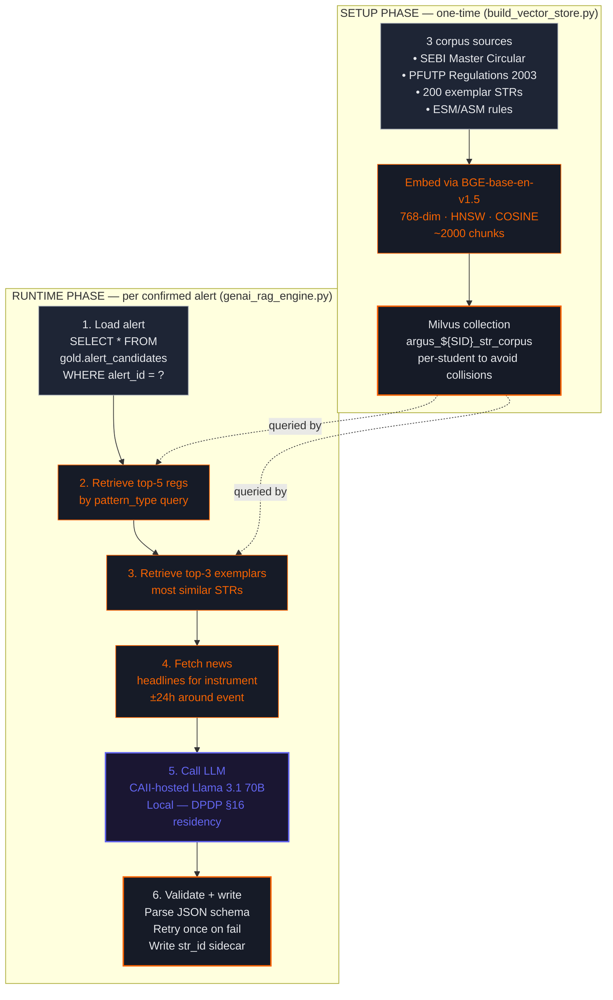

# Module 6 — GenAI / RAG STR Narrative Engine

Day 8 · Closes **ARG-4** (40-min hand-written STR backlog) · CP-15 (retrieval) · CP-16 (drafts)

## Two-phase architecture

The module has a one-time setup phase that builds the vector store, and a runtime phase that runs per confirmed alert.

## 5 locked system-prompt constraints (PRD §9)

These are **enforced, not optional** — they're how the lab teaches responsible LLM deployment in regulated contexts:

1. **No fabrication** — quote only values present in the structured payload
2. **Correct citation** — each pattern type maps to specific PFUTP regulation
3. **Behavior, not intent** — "the order pattern is consistent with X" not "the trader intended to manipulate"
4. **No named cases** — no "this resembles the Adani case" or any other identifiable reference
5. **English only** — Hindi versions written by humans for local jurisdiction filing

Output must validate against the required-keys JSON schema. **Fallback**: malformed JSON → retry once with stricter prompt → still bad? Write `FALLBACK_TEMPLATE` skeleton with `narrative_generation_failed=true`. Never silently fail; every confirmed alert always gets *something*.

## What this closes

| Pre-ARGUS | Post-ARGUS |
|---|---|
| 40 minutes per STR (hand-written) | 8 minutes (5s LLM + 8min analyst review) |
| 340-report backlog, oldest 70 days | Zero backlog |
| Analyst time absorbed by paperwork | Analyst time on actual investigation |

The 5-second LLM step does the boilerplate — citation lookup, exemplar paraphrasing, structured fact assembly. Analysts spend their 8 minutes on what matters: did the model get it right? Are the dates/quantities accurate? Should I escalate?

## Why local-hosted LLM (DPDP §16)

DPDP Act §16 + RBI guidance require personal data of Indian data principals to stay within India. Calling OpenAI or Anthropic from this engine would violate that — Module 6's LLM is **CAII-hosted Llama 3.1 70B** running inside the same DPDP-compliant data plane as everything else. Same applies to the embedding model (BGE-base-en-v1.5, also CAII-hosted).
