# Module 7 — SDX Governance + DPDP Compliance

Day 9 · Closes **ARG-5** · CP-17 / CP-18 / **CP-19 ⚠ COMPLIANCE GATE**

## Three sub-flows, three checkpoints

```mermaid
flowchart TB
    classDef src     fill:#1e2535,stroke:#9ca3af,color:#e5e7eb
    classDef step    fill:#161b27,stroke:#f96302,color:#f96302
    classDef cp      fill:#1a1632,stroke:#6366f1,color:#6366f1,stroke-width:1.5px
    classDef gate    fill:#1a1632,stroke:#6366f1,color:#6366f1,stroke-width:3px

    %% Sub-flow 1: Atlas
    subgraph SF1["SUB-FLOW 1 — Atlas Classifications · CP-17"]
      direction LR
      A1[("atlas_classifications.json<br/>6 logical tags ×<br/>per-student physical copies")]:::src
      A2["Phase 1 — create types<br/>PII_HIGH_${SID}, PII_LOW_${SID}, ...<br/>idempotent · skips existing"]:::step
      A3["Phase 2 — apply to columns<br/>~30 column attachments<br/>propagate=true (lineage)"]:::step
      A4["✓ CP-17<br/>≥6 types registered<br/>≥30 attachments visible"]:::cp
      A1 --> A2 --> A3 --> A4
    end

    %% Sub-flow 2: Consent
    subgraph SF2["SUB-FLOW 2 — DPDP §6(4) Consent Withdrawal · CP-18"]
      direction LR
      C1["Investor opts out of<br/>ANALYTICS, MARKETING<br/>via Consent Manager"]:::src
      C2["UPDATE silver.member_master<br/>consent_status=WITHDRAWN<br/>statutory purposes kept (DPDP §7)"]:::step
      C3["AUDIT row written<br/>gold.consent_audit<br/>event=CONSENT_WITHDRAWN<br/>+ pre/post Iceberg snapshots"]:::step
      C4["✓ CP-18<br/>Researcher view excludes investor<br/>Surveillance view still includes"]:::cp
      C1 --> C2 --> C3 --> C4
    end

    %% Sub-flow 3: Erasure (THE GATE)
    subgraph SF3["⚠ SUB-FLOW 3 — DPDP §12 Erasure · CP-19 COMPLIANCE GATE"]
      direction LR
      E1["DPO receives §12 request<br/>Identity verified upstream<br/>(DigiLocker / Aadhaar OTP)"]:::src
      E2["SNAPSHOT BEFORE<br/>capture pre-Iceberg snapshot_id<br/>for every target table"]:::gate
      E3["DELETE PII<br/>silver.member_master<br/>bronze.member_cdc<br/>+ Milvus sweep"]:::gate
      E4["RETAIN STATUTORY<br/>SEBI_AUDIT_TRAIL tables kept<br/>(DPDP §7 exception)"]:::gate
      E5["AUDIT ROW + SNAPSHOT_AFTER<br/>event=ERASURE_COMPLETED<br/>pre_snap + post_snap recorded"]:::gate
      E6["⚠ CP-19 — TIME-TRAVEL PROOF<br/>FOR SYSTEM_VERSION AS OF pre_snap → rows VISIBLE<br/>FOR SYSTEM_VERSION AS OF post_snap → ZERO rows"]:::gate
      E1 --> E2 --> E3 --> E4 --> E5 --> E6
    end
```



## CP-19 — THE COMPLIANCE GATE

> **Failing CP-19 fails the entire capstone, regardless of overall score.** This is intentional: a surveillance platform that can't prove DPDP §12 compliance is unlawful to operate.

### Required evidence

| Evidence | What it proves |
|---|---|
| ≥1 `ERASURE_COMPLETED` row with both `pre_snap` and `post_snap` populated | Erasure workflow ran end-to-end |
| `SELECT FOR SYSTEM_VERSION AS OF <pre_snap>` returns the erased rows | The data did exist (statutory non-repudiation) |
| `SELECT FOR SYSTEM_VERSION AS OF <post_snap>` returns zero rows | Erasure was actually applied |
| Statutory tables (tagged `SEBI_AUDIT_TRAIL_${SID}`) still contain rows post-erasure | DPDP §7 retention working |

### The proof loop in SQL

```sql
-- Read the audit row
SELECT pre_snap, post_snap
FROM argus_${STUDENT_ID}_gold.consent_audit
WHERE event_type = 'ERASURE_COMPLETED'
  AND investor_pan_hash = '<hash>';

-- Pre-snapshot — proves data existed
SELECT investor_pan_hash, investor_email, ...
FROM argus_${STUDENT_ID}_silver.member_master
  FOR SYSTEM_VERSION AS OF <pre_snap>
WHERE investor_pan_hash = '<hash>';
-- Returns 1 row

-- Post-snapshot — proves erasure was applied
SELECT investor_pan_hash, investor_email, ...
FROM argus_${STUDENT_ID}_silver.member_master
  FOR SYSTEM_VERSION AS OF <post_snap>
WHERE investor_pan_hash = '<hash>';
-- Returns 0 rows ← CP-19 PASSES

-- Statutory retention — proves DPDP §7 working
SELECT COUNT(*)
FROM argus_${STUDENT_ID}_gold.alert_candidates
WHERE investor_pan_hash = '<hash>';
-- Returns >0 rows (statutory retention preserved)
```

## Why all three matter

ARG-5 is "no lineage / no consent / no erasure" — three problems, three sub-flows, three checkpoints. CP-17 covers lineage (Atlas). CP-18 covers consent (DPDP §6(4)). CP-19 covers erasure (DPDP §12).

CP-19 is the gate because it's the **non-falsifiable** check. The other CPs verify configuration. CP-19 verifies that configuration *actually does what it claims* — using Iceberg's time-travel snapshots as legally-binding evidence both that the data existed and that it's gone. No other capability in CDP gives you that, which is why this is the architectural anchor of the entire ARGUS solution.
